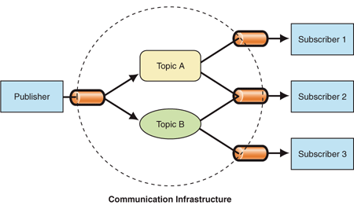

# redis之mq实现发布订阅模式



- [示例代码-github](https://github.com/smltq/spring-boot-demo/blob/master/mq-redis)

## 概述

Redis不仅可作为缓存服务器，还可用作消息队列，本示例演示如何使用redis实现发布/订阅消息队列。

- 在Redis中，发布者没有将消息发送给特定订阅者的程序。相反，发布的消息被描述为通道，而不知道(如果有的话)可能有哪些订阅者。
- 订阅者表示对一个或多个主题感兴趣，只接收感兴趣的消息，而不知道(如果有的话)发布者是什么。
- 发布者和订阅者的这种解耦可以实现更大的可伸缩性和更动态的网络拓扑。

## 代码实现

redis实现mq的存储方式很多，可以使用list,zset及stream，这些数据的存储结构决定了怎么消费问题（消息是一次使用、允许多次使用、允许多端消息等），比如使用list，我们可以使用leftPush插入消息，使用rightPop消费消息，实现一条消息一次消费，可以参考与以示例代码：

````java
    @Test
    public void testMq() {
        for (int i = 0; i < 10; i++) {
            redisTemplate.opsForList().leftPush("task-queue", "data" + i);
            log.info("插入了一个新的任务==>{}", "data" + i);
        }
        String taskId = redisTemplate.opsForList().rightPop("task-queue").toString();
        log.info("处理成功，清除任务==>{}", taskId);
    }
````

### 1.配置代码RedisConfig.java

```java
package demo.data.mqRedis.config;

import org.springframework.beans.factory.annotation.Autowired;
import org.springframework.cache.annotation.CachingConfigurerSupport;
import org.springframework.cache.annotation.EnableCaching;
import org.springframework.context.annotation.Bean;
import org.springframework.context.annotation.Configuration;
import org.springframework.data.redis.connection.RedisConnectionFactory;
import org.springframework.data.redis.core.RedisTemplate;
import org.springframework.data.redis.core.StringRedisTemplate;
import org.springframework.data.redis.listener.ChannelTopic;
import org.springframework.data.redis.listener.RedisMessageListenerContainer;
import org.springframework.data.redis.listener.adapter.MessageListenerAdapter;
import org.springframework.data.redis.serializer.GenericJackson2JsonRedisSerializer;
import org.springframework.data.redis.serializer.StringRedisSerializer;

@Configuration
@EnableCaching
public class RedisConfig extends CachingConfigurerSupport {

    @Autowired
    private RedisTemplate redisTemplate;

    /**
     * redisTemplate 序列化使用的jdkSerializeable, 存储二进制字节码, 所以自定义序列化类,方便调试redis
     *
     * @param redisConnectionFactory
     * @return
     */
    @Bean
    public RedisTemplate<String, Object> redisTemplate(RedisConnectionFactory redisConnectionFactory) {

        RedisTemplate<String, Object> redisTemplate = new RedisTemplate<>();

        //使用Jackson2JsonRedisSerializer来序列化和反序列化redis的value值
        redisTemplate.setValueSerializer(new GenericJackson2JsonRedisSerializer());
        redisTemplate.setHashValueSerializer(new GenericJackson2JsonRedisSerializer());

        //使用StringRedisSerializer来序列化和反序列化redis的ke
        redisTemplate.setKeySerializer(new StringRedisSerializer());
        redisTemplate.setHashKeySerializer(new StringRedisSerializer());

        //开启事务
        redisTemplate.setEnableTransactionSupport(true);

        redisTemplate.setConnectionFactory(redisConnectionFactory);

        return redisTemplate;
    }

    @Bean
    MessageListenerAdapter messageListener() {
        return new MessageListenerAdapter(new RedisMessageSubscriber());
    }

    @Bean
    RedisMessageListenerContainer container(RedisConnectionFactory connectionFactory,
                                            MessageListenerAdapter listenerAdapter) {

        RedisMessageListenerContainer container = new RedisMessageListenerContainer();
        container.setConnectionFactory(connectionFactory);
        container.addMessageListener(listenerAdapter, topic());

        return container;
    }

    @Bean
    MessagePublisher redisPublisher() {
        return new RedisMessagePublisher(redisTemplate, topic());
    }

    @Bean
    ChannelTopic topic() {
        return new ChannelTopic("messageQueue");
    }
}

```

### 2.定义消息发布接口MessagePublisher.java

```java
package demo.data.mqRedis.config;

public interface MessagePublisher {
    void publish(String message);
}
```

### 3.发布方实现RedisMessagePublisher.java

```java
package demo.data.mqRedis.config;

import org.springframework.beans.factory.annotation.Autowired;
import org.springframework.data.redis.core.RedisTemplate;
import org.springframework.data.redis.listener.ChannelTopic;

/**
 * 消息发布方
 */
public class RedisMessagePublisher implements MessagePublisher {

    @Autowired
    private RedisTemplate<String, Object> redisTemplate;

    @Autowired
    private ChannelTopic topic;

    public RedisMessagePublisher(
            RedisTemplate<String, Object> redisTemplate, ChannelTopic topic) {
        this.redisTemplate = redisTemplate;
        this.topic = topic;
    }

    public void publish(String message) {
        redisTemplate.convertAndSend(topic.getTopic(), message);
    }
}
```

### 4.消息接收方RedisMessageSubscriber.java

````java
package demo.data.mqRedis.config;

import lombok.extern.slf4j.Slf4j;
import org.springframework.data.redis.connection.Message;
import org.springframework.data.redis.connection.MessageListener;
import org.springframework.stereotype.Service;

import java.util.ArrayList;
import java.util.List;

/**
 * 消息订阅方
 */
@Service
@Slf4j
public class RedisMessageSubscriber implements MessageListener {

    public static List<String> messageList = new ArrayList<>();

    public void onMessage(Message message, byte[] pattern) {
        messageList.add(message.toString());
        log.info("订阅方接收到了消息==>{}", message.toString());
    }
}
````

### 5.最后贴上application.yml配置

```yaml
spring:
  redis:
    host: 127.0.0.1
    port: 6379
    password:
```

## 查看运行结果

### 1.编写测试用例试发布消息TestRedisMQ.java

```java
package demo.data.mqRedis;

import demo.data.mqRedis.config.RedisMessagePublisher;
import lombok.extern.slf4j.Slf4j;
import org.junit.Test;
import org.junit.runner.RunWith;
import org.springframework.beans.factory.annotation.Autowired;
import org.springframework.boot.test.context.SpringBootTest;
import org.springframework.test.context.junit4.SpringRunner;

import java.util.UUID;

@RunWith(SpringRunner.class)
@SpringBootTest
@Slf4j
public class TestRedisMQ {

    @Autowired
    RedisMessagePublisher redisMessagePublisher;

    @Test
    public void testMq() {
        String message = "Message " + UUID.randomUUID();
        redisMessagePublisher.publish(message);
    }
}
```

### 2.运行结果

```cfml
2019-09-05 15:51:33.931  INFO 10772 --- [    container-2] d.d.m.config.RedisMessageSubscriber      : 订阅方接收到了消息==>"Message c95959bf-6c30-4801-bc80-0e1e3c9f81bc"
```

订阅方成功接收到消息了

## 资料

- [示例代码-github](https://github.com/smltq/spring-boot-demo/blob/master/mq-redis)
- [redis实现mq的方案以及stream的应用](https://www.jianshu.com/p/e5751c2ac9c8)
- [发布-订阅模式](https://docs.microsoft.com/en-us/previous-versions/msp-n-p/ff649664(v=pandp.10))